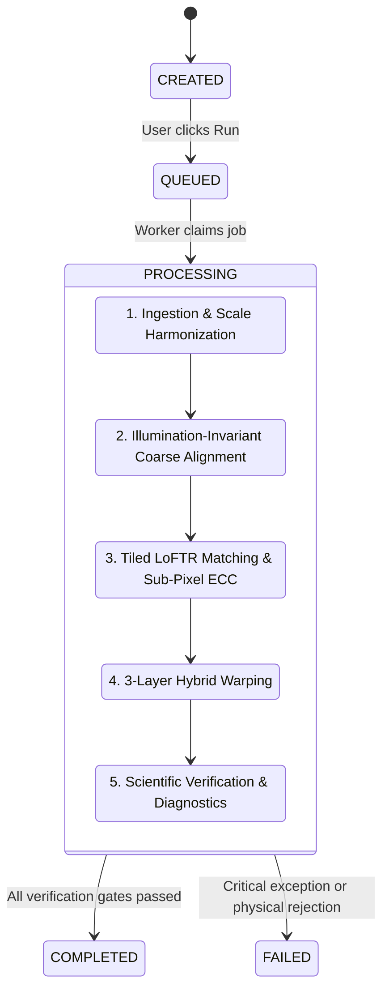

# ChandraShakti — REST API & Backend Architecture

The ChandraShakti backend is powered by **FastAPI**, **SQLAlchemy**, and a non-blocking in-process background worker (`backend/worker.py`). It provides a complete RESTful API for automated batch processing, enterprise job management, and live progress streaming.

---

## 🚀 Starting the Server

```bash
uvicorn backend.main:app --host 127.0.0.1 --port 8000 --reload
```

Interactive OpenAPI documentation is automatically served at:
- **Swagger UI**: [http://127.0.0.1:8000/docs](http://127.0.0.1:8000/docs)
- **ReDoc**: [http://127.0.0.1:8000/redoc](http://127.0.0.1:8000/redoc)

---

## 📡 REST Endpoints

### 1. System Health
- **`GET /health`**
  - Returns service status, database connectivity, and CUDA GPU acceleration info.
  ```json
  {
    "status": "online",
    "version": "2.0.0",
    "db": "sqlite",
    "gpu_available": true,
    "gpu_name": "NVIDIA GeForce RTX"
  }
  ```

---

### 2. File Upload & Ingestion
- **`POST /api/v1/files/upload`**
  - Content-Type: `multipart/form-data`
  - Uploads raw planetary rasters or PDS archives into `data/storage/uploads/`.
  - Automatically extracts geospatial bounding coordinates, GSD, and dimensions.

---

### 3. Registration Projects & Jobs
- **`POST /api/v1/projects`**
  - Creates a new registration experiment configuration.
- **`GET /api/v1/projects`**
  - Lists all existing projects with pagination and status filters.
- **`GET /api/v1/projects/{project_id}`**
  - Fetches project metadata, stage status, input file paths, and output metrics.
- **`POST /api/v1/projects/{project_id}/run`**
  - Triggers asynchronous execution of the 5-phase registration pipeline in a background thread.
- **`GET /api/v1/projects/{project_id}/status`**
  - Returns real-time stage progress percentages ($0 - 100\%$) and live diagnostic messages.

---

### 4. Metrics & Export
- **`GET /api/v1/projects/{project_id}/metrics`**
  - Returns the official `verification_metrics.json` report containing RMSE, inlier counts, spatial entropy, and composite confidence score.
- **`GET /api/v1/projects/{project_id}/artifacts/{filename}`**
  - Streams registration products (`registered_subpixel.tif`, `hybrid_transform_model.json`, `tie_points_inliers.csv`) or preview PNGs.

---

## 🔄 State Machine & Stage Telemetry


