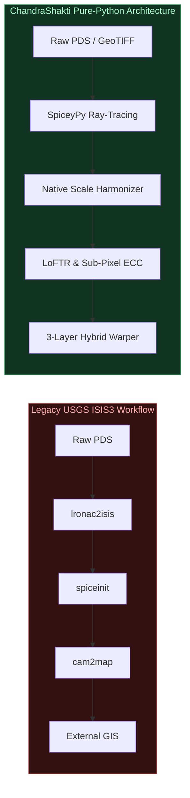

# ChandraShakti (चन्द्रशक्ति) — System Architecture

**Next-Gen Universal Sub-Pixel Lunar Image Co-Registration Engine**  
*ISRO Smart India Hackathon (SIH 2024) — Problem Statement SIH26166*

---

## 1. Architectural Philosophy: 100% ISIS-Free

Traditional planetary processing systems rely on USGS ISIS3 (`cam2map`, `spiceinit`, `lronac2isis`). ISIS3 introduces severe operational bottlenecks:
- Requires dedicated Ubuntu/RHEL Linux or Docker containers on Windows/macOS.
- Monolithic CLI binaries invoke expensive disk re-writes between every step.
- Multi-gigabyte runtime footprint with fragile C++ library linkages.

**ChandraShakti** replaces ISIS3 completely with a **100% pure Python and standard C-extension architecture** (Rasterio, GDAL, NASA NAIF `SpiceyPy`, PyTorch, OpenCV, SciPy). It runs natively on Windows, Linux, and macOS with zero virtualization overhead.

---

## 2. Five-Phase Registration Pipeline

```mermaid
graph TD
    subgraph Phase1["Phase 1: Ingestion & Scale Harmonization"]
        P1_A[Raw PDS3/PDS4/GeoTIFF] --> P1_B[Pure-Python Ingest & SPICE Georeferencing]
        P1_B --> P1_C[Push-Frame / SWIR Band Selection]
        P1_C --> P1_D[Streaming Scale Harmonization & BBox Overlap]
    end

    subgraph Phase2["Phase 2: Illumination-Invariant Coarse Alignment"]
        P1_D --> P2_A[Log-Gabor Phase Congruency & Multi-Scale Gradient]
        P2_A --> P2_B[Decimated 2D FFT Phase Correlation & Crater Consensus]
        P2_B --> P2_C[Along-Track Drift Initialization]
    end

    subgraph Phase3["Phase 3: Tiled Matching & Sub-Pixel ECC"]
        P2_C --> P3_A[Uniform Tiled Partitioning with Adaptive Overlap]
        P3_A --> P3_B[Deep Dense Matcher: LoFTR Transformer]
        P3_B --> P3_C[Gauss-Newton Sub-Pixel ECC Refinement rho >= 0.60]
    end

    subgraph Phase4["Phase 4: 3-Layer Physics-Grounded Hybrid Deformation"]
        P3_C --> P4_A[Layer 1: Curvature-Tolerant Affine Baseline]
        P4_A --> P4_B[Layer 2: Along-Track Drift Polynomial dY=f Y]
        P4_B --> P4_C[Layer 2.5: Stratified Two-Pass Physical Consensus]
        P4_C --> P4_D[Layer 3: Regularized Thin Plate Splines TPS]
        P4_D --> P4_E[Streaming Windowed Bicubic Warper order=3]
    end

    subgraph Phase5["Phase 5: Multi-Pillar Scientific Verification"]
        P4_E --> P5_A[Pillar 1: Authoritative 5-Fold Cross-Validation RMSE]
        P5_A --> P5_B[Pillar 2: Spatial Shannon Entropy & Swath Span]
        P5_B --> P5_C[Pillar 3: Inlier Count & Convex Hull Coverage]
        P5_C --> P5_D[Pillar 4: Structural Similarity Index SSIM]
        P5_D --> P5_E[Official Verification Dashboard & Heatmaps]
    end
```

---

## 3. Mathematical Formulation of the 3-Layer Hybrid Model

Satellite pushbroom imagery over long orbital trajectories exhibits complex non-rigid deformation consisting of three distinct physical phenomena:
$$\mathbf{x}_{\text{ref}} = \mathcal{T}(\mathbf{x}_{\text{src}}) = \mathcal{T}_1(\mathbf{x}_{\text{src}}) + \mathcal{T}_2(y_{\text{src}}) + \mathcal{T}_3(\mathbf{x}_{\text{src}})$$

### Layer 1: Global Affine / Rigid Euclidean Baseline
Establishes the fundamental linear coordinate reference frame between orbits:
$$\mathcal{T}_1(\mathbf{x}) = \mathbf{A}\mathbf{x} + \mathbf{t}, \quad \mathbf{A} \in \mathbb{R}^{2 \times 2}, \mathbf{t} \in \mathbb{R}^2$$
- On long orbital swaths ($> 5,000\text{ px}$), the RANSAC threshold dynamically adapts to accommodate physical pushbroom orbital trajectory curvature without admitting blunders:
  $$\tau_{\text{L1}} = \max\left(\tau_{\text{user}}, \min\left(5.5, 0.00033 \times D_{\text{scene}}\right)\right)$$
- Enforces an automated **Physical Scale Firewall** ($0.92 \le s_x, s_y \le 1.08$), falling back to rigid Euclidean transformation if scale factors diverge unphysically.

### Layer 2: 1D Along-Track Pushbroom Scanline Drift Polynomial
Models continuous unmodeled spacecraft orbital jitter, pitch/yaw attitude rate drift, and thermal sensor flexure as a function of along-track line index $y$:
$$\mathcal{T}_2(y) = \begin{bmatrix} \sum_{k=0}^d c_{x,k} \left(\frac{y - \mu_y}{\sigma_y}\right)^k \\ \sum_{k=0}^d c_{y,k} \left(\frac{y - \mu_y}{\sigma_y}\right)^k \end{bmatrix}$$
- Coordinates are normalized to zero-mean unit-variance to eliminate Vandermonde matrix ill-conditioning (reducing condition number from $\sim 10^9$ to $\sim 9$).
- Guarded by along-track span safety: if inliers span $< 25\%$ of the total swath, the polynomial degree automatically clamps to $0$ to prevent unanchored boundary extrapolation runaway.

### Layer 2.5: Stratified Two-Pass Physical Consensus
Guarantees that tie-point anchors are retained across all along-track altitude bins (North, Middle, South) rather than collapsing into a single crater cluster:
- **Pass 1**: Partitions points into along-track bins; selects consensus points matching the smooth orbital polynomial with MAD-based adaptive thresholding.
- **Pass 2 (Blunder Spike Rejection)**: Prunes individual blunder residual spikes ($> 1.15\text{ px}$) to protect the non-rigid spline from overfitting.

### Layer 3: Normalized Regularized Thin Plate Splines (TPS)
Absorbs residual local topographic relief displacement using bi-harmonic radial basis functions:
$$\mathcal{T}_3(\mathbf{x}) = \sum_{i=1}^N \mathbf{w}_i \, \phi(\|\tilde{\mathbf{x}} - \tilde{\mathbf{x}}_i\|), \quad \phi(r) = r^2 \ln(r)$$
- TPS coordinates are normalized to the inlier bounding centroid and standard deviation.
- Regularization parameter $\lambda$ is $N$-adaptive:
  $$\lambda = \min(\lambda_{\text{user}}, 0.01) \times \left(\frac{50.0}{\max(30.0, N_{\text{inliers}})}\right)$$
  ensuring stable elastic stiffness regardless of tie-point density.

---

## 4. Streaming Windowed I/O Memory Architecture

For multi-gigapixel rasters exceeding $100{,}000 \times 15{,}000\text{ pixels}$ ($> 10\text{ GB}$ uncompressed float32 per layer):
1. **Zero-Copy Ingestion**: Raw binary labels stream through `np.memmap` matching exact byte offsets.
2. **Windowed Bicubic Warping**: Warping evaluates the inverted coordinate mesh block-by-block using Rasterio windowed chunking (`Window(col_off, row_off, width, height)`).
3. **RAM Ceiling**: Peak memory consumption is strictly capped under **$50\text{ MB}$** during warping, running effortlessly on low-spec edge hardware or high-throughput cloud clusters.
