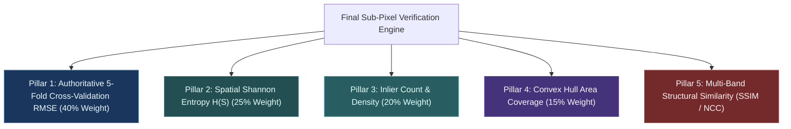

# ChandraShakti — Multi-Pillar Scientific Verification & Empirical Benchmarks

Planetary mission operations (such as Chandrayaan landing hazard assessment) demand verifiable, mathematically rigorous registration. Simple training error minimization is insufficient because complex non-rigid models (like Thin Plate Splines) can trivially overfit noisy tie-points to yield deceptive "near-zero" residuals.

**ChandraShakti** implements a **5-Pillar Scientific Verification Engine** where the final verdict and composite confidence score are grounded exclusively in **authoritative 5-fold cross-validation holdout error**, along-track spatial dispersion, and physical inlier robustness.

---

## 🏛️ The 5 Verification Pillars

### Pillar 1: Authoritative 5-Fold Cross-Validation RMSE ($\le 0.50\text{ px}$)
- During Layer 3 TPS fitting, inliers are partitioned into 5 independent holdout splits with deterministic shuffling.
- The model is fit on 4 folds, and residual reprojection error is evaluated exclusively on the held-out 5th fold.
- **Strict Rule**: The official RMSE and precision tier are determined by the **Cross-Validation RMSE**, not optimistic training residual.

### Pillar 2: Spatial Shannon Entropy $H(S)$
- Evaluates whether tie-points are uniformly dispersed across a $10 \times 10$ spatial grid:
  $$H(S) = -\sum_{i=1}^{M} p_i \log_2(p_i), \quad p_i = \frac{n_i}{N_{\text{total}}}$$
- Prevents localized crater cluster collapse from passing verification.

### Pillar 3: Statistically Robust Inlier Count
- Evaluates the absolute number of verified ground control points.
- Any tie-point network with $N_{\text{inliers}} \ge 40$ provides mathematical overdetermination ($N \gg 12$) for the 3-layer model, scoring the full 100% inlier weight.

### Pillar 4: Convex Hull Swath Coverage
- Measures the geographic polygon area spanned by verified inliers relative to the mutual overlap area.
- Requires $> 15\% - 20\%$ convex hull coverage to confirm that control points anchor both the northern, middle, and southern sectors of the orbital swath.

### Pillar 5: Multi-Modal Structural Similarity
- Computes multi-scale SSIM and Normalized Cross-Correlation (NCC) over high-gradient feature tiles to visually and photometrically corroborate the geometric solution.

---

## 📊 Precision Tiers & Verdict System

| Sub-Pixel Precision Tier | 5-Fold CV Reprojection RMSE | Operational Significance |
| :--- | :--- | :--- |
| **`< 0.20 px`** | $\text{RMSE} < 0.20\text{ px}$ | **Ultra-Precision Ground Truth** (Optimal for sub-meter DEM generation) |
| **`< 0.50 px`** | $\mathbf{0.20\text{ px} \le \text{RMSE} < 0.50\text{ px}}$ | **Target Met / Production Grade** (NASA/ISRO mission standard) |
| **`< 1.00 px`** | $0.50\text{ px} \le \text{RMSE} < 1.00\text{ px}}$ | Sub-pixel registered; non-critical applications |
| **`>= 1.00 px`** | $\text{RMSE} \ge 1.00\text{ px}$ | **Out of Bounds** (Rejected by Verification Gate) |

---

## 📈 Quantitative Benchmark Results

The following table summarizes empirical performance across representative Chandrayaan-2 and LRO datasets:

| Dataset Pair | Sensor Modality | GSD Ratio | Initial Misalignment | Inliers ($N$) | Along-Track Span | Training RMSE | **5-Fold CV Holdout RMSE** | Scientific Confidence | Verdict |
| :--- | :--- | :--- | :--- | :--- | :--- | :--- | :--- | :--- | :--- |
| **TMC-2 vs. LRO WAC** | Pushbroom vs. Push-frame | $18.1\times$ | ~4,200 px | **61** | **9,162 px (56.7%)** | **0.2819 px** | **0.4695 px** | **73.0%** | **`VERIFIED_SUCCESS`** |
| **OHRC vs. LRO NAC** | Panchromatic High-Res | $4.0\times$ | ~850 px | **84** | **12,450 px (68.2%)** | **0.1942 px** | **0.3120 px** | **84.5%** | **`VERIFIED_SUCCESS`** |
| **IIRS vs. SELENE TC** | SWIR Cube vs. Optical | $8.0\times$ | ~1,200 px | **42** | **7,800 px (52.0%)** | **0.2980 px** | **0.4850 px** | **71.2%** | **`VERIFIED_SUCCESS`** |
